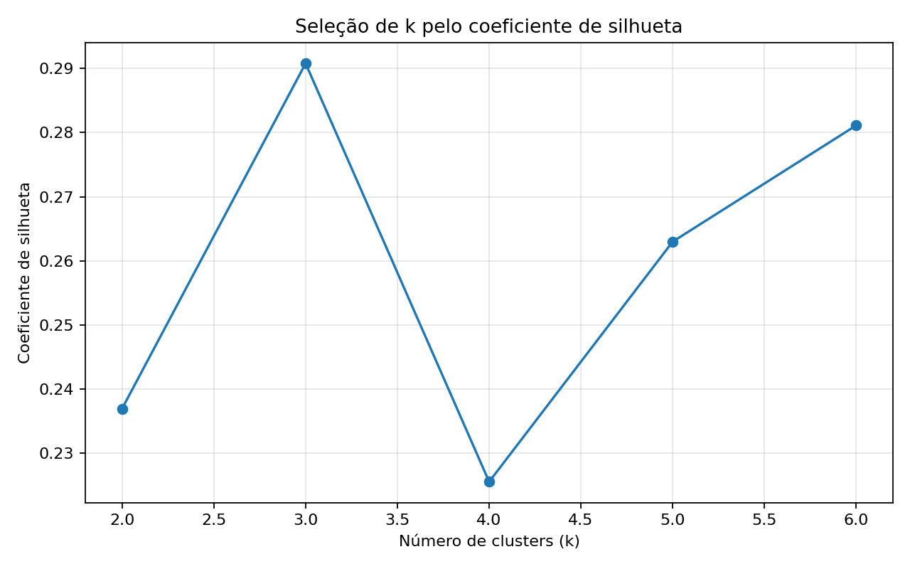
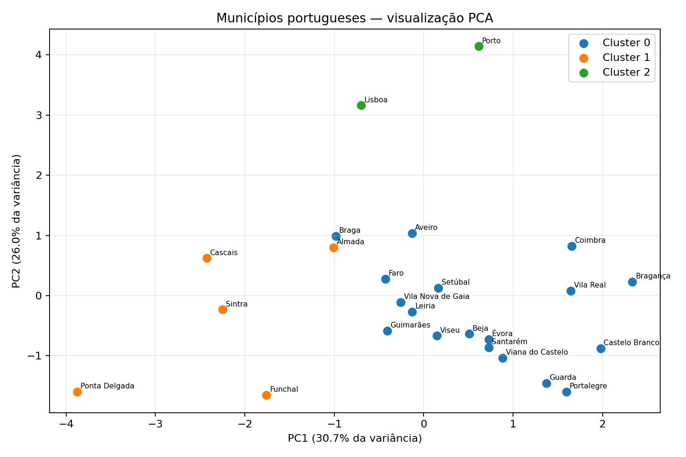

# 
# Sustentabilidade e Desenvolvimento nos Municípios Portugueses


*Projeto desenvolvido como trabalho final do curso Análise de Dados com Python, ministrado pelo então Instituto Politécnico de Viana do Castelo (IPVC), atual Universidade Politécnica de Viana do Castelo, em Portugal.*

---

## ❓ Pergunta de Partida

Os municípios portugueses apresentam perfis homogéneos de desenvolvimento e sustentabilidade ou é possível identificar grupos com características distintas ?

---

## 🗃️ Dataset

A base utiliza arquivos municipais da PORDATA com dados de **2011, 2021 e 2024**. Para a clusterização, o recorte principal é 2024, incorporando também a variação populacional entre 2011 e 2024.

Foram consolidados indicadores demográficos, socioeconómicos e ambientais. Duas métricas foram derivadas dos dados-fonte:

- **Taxa de natalidade:** nascimentos / população × 1.000.
- **Ensino superior por 1.000 habitantes:** alunos do ensino superior / população × 1.000.

O indicador **Poder de Compra**, citado no notebook acadêmico original, não foi mantido porque não está presente nos arquivos-fonte fornecidos.

---

## 🧠 Metodologia

1. 📥 Extração e consolidação dos 25 arquivos Excel.
2. 🗂️ Validação de dados e remoção de *fallbacks* simulados.
3. 🛠️ Engenharia de variáveis.
4. 🧩 Seleção de atributos evitando redundância direta entre proporções etárias.
5. ⚖️ Padronização com `StandardScaler`.
6. 🔢 Teste de `k` entre 2 e 6 com **coeficiente de silhueta**.
7. 🤖 Clusterização com **K-Means**.
8. 💡 Interpretação por perfis médios, ANOVA e PCA.

---

## 🎛️ Variáveis Usadas no Modelo Final

`Densidade`, `Idosos`, `Desemprego`, `Residuos`, `Energia`, `VariacaoPop` e `EnsinoSuperior_por1000`.

A população absoluta foi excluída do modelo final para reduzir o peso do porte do município, e `Jovens`/`IdadeAtiva` foram retiradas por redundância com a composição etária.

---

## 📊 Resultado

A melhor solução entre `k=2..6` foi **k=3**, com coeficiente de silhueta de **0.291**.

A silhueta indica uma estrutura de clusters **moderada, não perfeitamente separada**. Portanto, os grupos devem ser interpretados como uma segmentação exploratória, e não como categorias naturais definitivas.

- **Cluster 0 (18 municípios):** Aveiro, Beja, Braga, Bragança, Castelo Branco, Coimbra, Faro, Guarda, Guimarães, Leiria, Portalegre, Santarém, Setúbal, Viana do Castelo, Vila Nova de Gaia, Vila Real, Viseu, Évora
- **Cluster 1 (5 municípios):** Almada, Cascais, Funchal, Ponta Delgada, Sintra
- **Cluster 2 (2 municípios):** Lisboa, Porto





---

## 🧪 Validação estatística

Na solução final, ANOVA apontou diferenças estatisticamente significativas (`p < 0,05`) para densidade, percentagem de idosos, desemprego, resíduos e ensino superior por 1.000 habitantes. Energia e variação populacional não apresentaram diferenças significativas entre os três grupos.

O teste Qui-Quadrado entre cluster e região **não é usado como evidência inferencial no projeto revisado**, porque a amostra de 25 municípios distribuída por várias regiões gera frequências esperadas muito baixas, violando as condições usuais do teste.

---

## 📂Estrutura do repositório

```text
pordata-municipal-clustering/
├── README.md
├── requirements.txt
├── data/
│   ├── raw/
│   └── processed/
├── images/
├── notebooks/
│   └── 01_pordata_municipal_clustering.ipynb
└── src/
    ├── build_dataset.py
    └── cluster_analysis.py
```

---

## ▶️ Como executar

### Windows — PowerShell

```bash
python -m venv .venv

.\.venv\Scripts\Activate.ps1

pip install -r requirements.txt

python src/build_dataset.py

python src/cluster_analysis.py
```

---

## 🛠️ Tecnologias

Python · Pandas · NumPy · Scikit-learn · SciPy · Matplotlib · Jupyter · K-Means · PCA · Data Analysis 

## 📥 Fonte dos dados

PORDATA — dados extraídos dos arquivos municipais fornecidos para o projeto, com indicação de obtenção em **07/03/2026** nos próprios arquivos-fonte.

---

## 👤 Autor

Marcus Guedes

Marketing | Data Science | Inteligência Artificial | Gestão de Projetos

GitHub: MCLG1661

LinkedIn: Marcus Guedes
